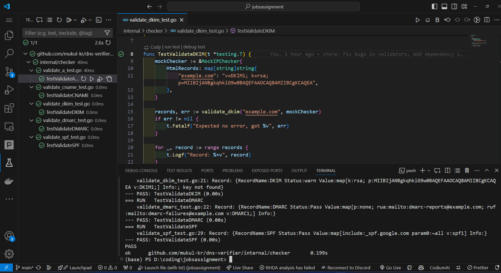
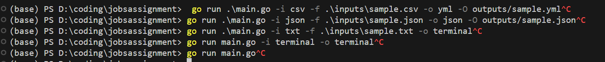

# DNS Verifier

A simple tool to check DNS configurations for domains. 

Features Completed:
- &#x2611; Take as input set of domain names (possibly from file)
- &#x2611; Check if the DNS configuration for domains are properly set or not (SPF, DKIM etc)
- &#x2611; List out a table/report (commandline output or file) with the result

Additional Features:
- &#x2611; Support for multiple input file formats (txt, json, csv)
- &#x2611; Support for multiple output file formats (json, yml)
- &#x2611; Support for terminal input
- &#x2611; Support for terminal output
- &#x2611; Support for multiple domain checks (SPF, DKIM, DMARC, A, CNAME)
- &#x2611; Write test cases for the records
- &#x2611; Add basic github-action workflow for testing


## Input File Formats

### See sample input in the input folder.

### Text File:
```txt
url1.com,url2.com,...
```

### JSON File:
```json
[
  {"url": "url1.com"},
  {"url": "url2.com"},
  ...
]
```

### CSV File:
```csv
url
url1.com
url2.com
...
```
Usage
```sh
go run main.go [flags]
Flags
-h, --help: Help for DNS Verifier.
-f, --input-file string: Input file path for the DNS Verifier (Not needed for terminal input).
-i, --input-type string: Input type for the DNS Verifier (csv, json, txt, terminal).
-O, --output-file string: Output file for the DNS Verifier (Not needed for terminal output).
-o, --output-type string: Output type for the DNS Verifier (json, yml, terminal).

```

## Examples

Running with a Text File
```sh
go run main.go -f input.txt -i txt -o output.json -O json
```

Running with a JSON File
```sh
go run main.go -f input.json -i json -o output.yml -O yml
```

Running with a CSV File
```sh
go run main.go -f input.csv -i csv -o output.yml -O yml
```

Running with Terminal Input
```sh
go run main.go -i terminal -o terminal
```
You will be prompted to enter the URLs in the terminal.

Direct Execution
```sh
go run main.go
```
You will be prompted to enter the URLs in the terminal.
Do as per prompted.


## Output

### See sample output in the output folder.

# Extras
<div align="center">

## Screenshots

### Tests


### Command Line


### Prompt


</div>